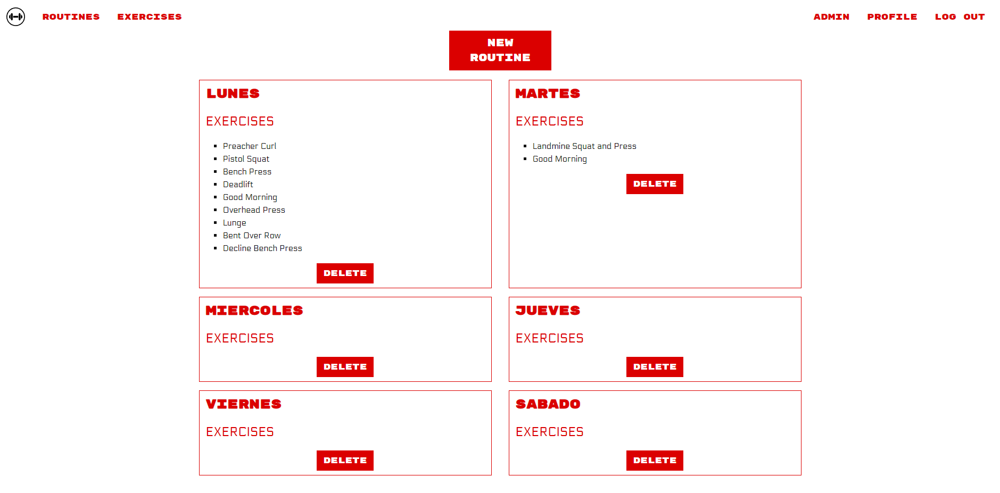

# LIFTER - Final project for GeeksHubs Academy

This is a React project using my own relational database and API. The project consists in a web application for people who enjoy going to the gym and want to track their routines and progress lifting weights.

## DEPLOY

The page is deployed [in AWS Amplify.](https://master.d3vose1xg6ck6v.amplifyapp.com)

## VIEWS

Landing page: fixed navbar with the name and slogan for the app, and buttons to register and login if the user already has an account. This page sets the design for the rest of the app, very squarish and bold.

Public exercise database: has two filtering options with dropdowns and a search bar with a 0,5sec debouncer. The filters can be used individually or at the same time and the search results are paginated. Each exercise has a detail view with a brief description indicating how to perform the movement and a .gif image demonstrating the muscles involved.

Login and register forms: simple but effective, the user provides only a username, email address and a password and can edit the rest of their details in their profile page.

Routine views: Each user has access to a private section of routines. They can create, edit and delete routines, as well as add any sets of exercises with personalized reps and weights to their page.

Admin view: The administrator of the page can see and delete users. There is a modal of confirmation before making the elimination definitive. Administrators cannot be deleted.

Every view is designed to be responsive and equally usable on mobile:

## Local use

Clone this repository and install dependencies with: 

### `npm i`

You can then run:

### `npm run start`

Runs the app in the development mode.\
Open [http://localhost:3000](http://localhost:3000) to view it in your browser.

The page will reload when you make changes.\
You may also see any lint errors in the console.

